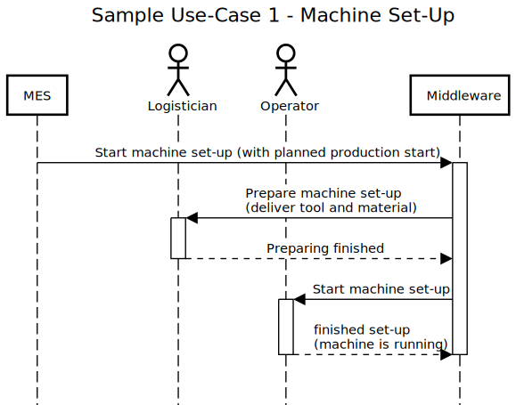
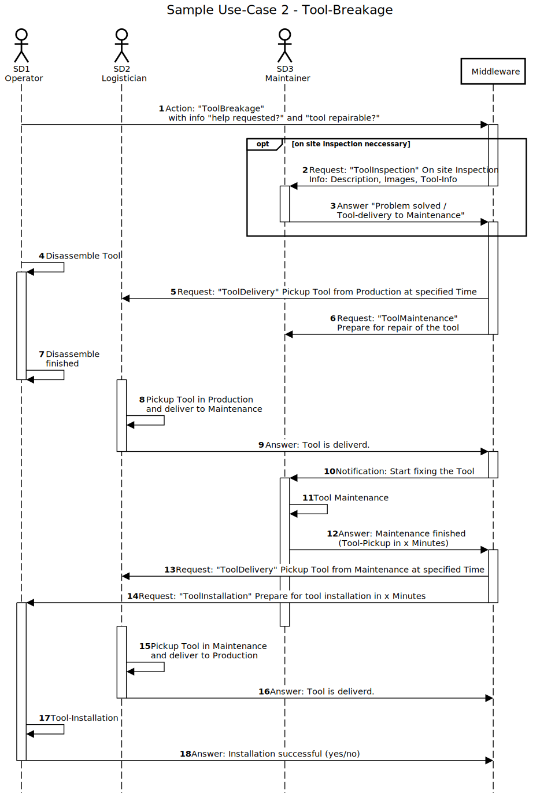
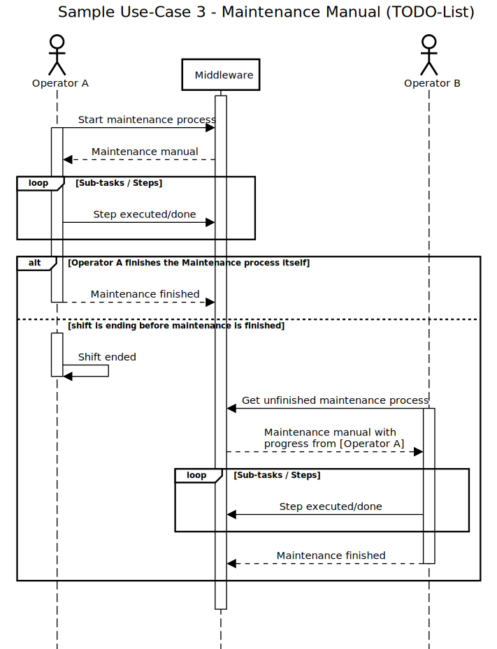
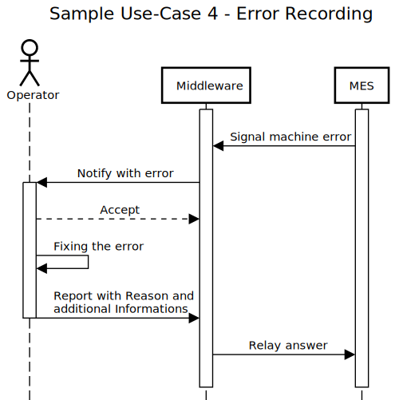
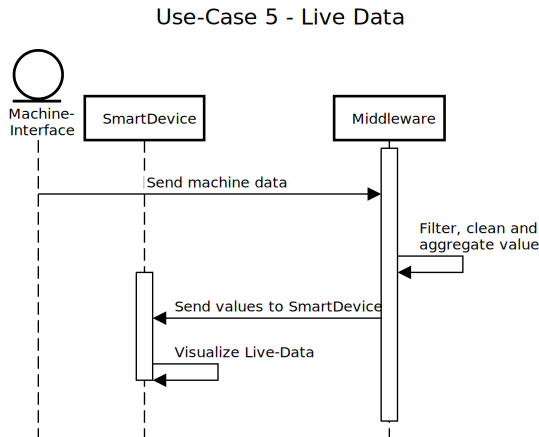
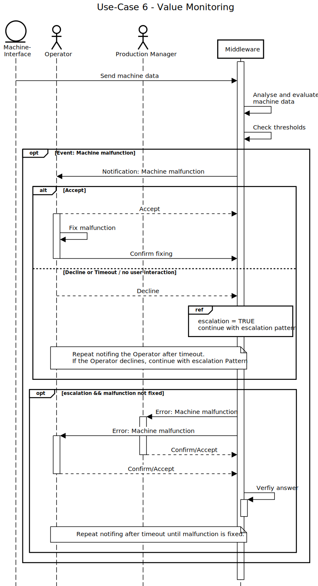

# List of Sample-Use-Cases

  * UC1 MachineSetUp (TODO)
  * UC2 ToolBreakage (TODO)
  * [UC3 MaintenanceManual (TODO)](/doc/use-cases-config/uc3/install_uc3.md)
  * UC4 ErrorRecording (TODO)
  * [UC5 LiveData](/doc/use-cases-config/uc5/install_uc5.md)
  * [UC6 ValueMonitoring (with notification) (InProgress)](/doc/use-cases-config/uc6/install_uc6.md)

__Note: This page is not finished yet__
__TODO: Translate to English__

## Sample Use-Case 1 - Machine Set-Up
[(sequencediagram.org - UC1 MachineSetUp)](https://sequencediagram.org/index.html#initialData=C4S2BsFMAIGUEMC2AHK0CqBnSBaAwvNtAIzQ7QCy8AxgBYgB2MskwO6yAUJ8vAE6hqIXg2DQARBQCiscdELQpAJQAKnGsAD2fCQBlNAcxCZBIeAzkLYAEWLrqWneIDyySH3iPLmONYBMPPymImKSIAAm4VAA7vyQ3pQA6tzKKjgAfBSJAFxwwEHQiDT0TNDYbACuyNAAFNFgtNCo5kzhTXya4RUOIJoMZfkCAJT2oABunjBZ3FkZNsS5KnyQvMuFxYww5ThVADoMNeGQ4CBj7tBamuDyDG1FwO5m4CMap5O+dpxZADw4OPOLZarRgGaAAM0YxlokHCnCOrwmDw+M0Sc38uVggzERTomzKrB2XAR7xsAVJf0yOXBkMw0La2z2BxxJRgxmgfAqDAYIJG8J6iOY-jhkGJSKyQA)

**Vorbereiten von Rüstprozessen mit Hilfe von Echtzeitfertigungsdaten**

Mitarbeiter und Logistiker werden durch die Middleware Benachrichtigt wenn Maschinen gerüstet werden müssen. Sie erhalten dazu alle nötigen Informationen um dem Rüstprozess so effizient wie möglich durchzuführen und unnötige Stillstandszeiten zu verhindern.

Dazu berechnet das ERP oder MES anhand der Maschinendaten die Zeiten wann ein Rüstvorgang fällig ist woraufhin die Middleware die Mitarbeiter mit genug zeitlichen Vorlauf Benachrichtigt und diese den Rüstprozess vorbereiten können.

## Sample Use-Case 2 - Tool Breakage
[(sequencediagram.org - UC2 ToolBreakage)](https://sequencediagram.org/index.html#initialData=C4S2BsFMAIGUEMC2AHK0CqBnSBaAwvNtAEzQ7QAqA9leDgEIBOk8A1vAOaQBQ38AxsCqNoAIlgARAIwAdAHYB5ZJEbwhjUdEJxpfQcLGTi8gDJUOITKH4h4czdqN71hiQGZ5AWXgg5wH3IqDpg6btzI8IzWIBF+Yp4gACaJUADukZDBOgDiAOq88ACuQnKFiABGKtBS3JJSOAB8knkAXNAAgoIgVHJtotS0TCzsXKLy0KlgABbQvgBmVGJTkODI0MwAjoWQVpCJAPwOcoliQrTrkBEgquVQh84gAG5qMM353FTIwNA90JhgMF8mGUXV+gX4-B2mEiAE9eG9GpI3G0AEqQLY7YB9AbgACScmBkFB9mgCjkfwB0HxhOJ8nxCzaEh2-EYMVAPQANFTEJwdlycTh6VQHs9gK93NxEiwuqLxXlahI8gAeHBItrtAmpKqiAAKjCot0giD+tEee2gAHp5AKpeAnioYdAhNBvL4xXI7JDRJLpaBZaERS8cvlIMcFfUmtJGZZCNgKmgcYGxToagq8oiJMQWmiMVZsTRwEy7WbGDDNDqQPxWIU1jjoHN9ca9VREoViVpvjSQHMQOaKCBEDw07kM8joDntnmxDjXX5Q57MvI9ZcMvWDMwriIqHMncsnQWfQI-UG3vDpBmpNHoZg44b5D25JZlolDzKT7oCm-k04FcQM1mKyrGtKALWZyWbVt23kOwTlte0RGdWd3QXX8M1aDpNRUNo60saA4JLRIADpX2Pb9MyTOV3gRSMxwAOSoUAe34NRul6OB-CiesQAAD18DhdxgRMpSPJ533lET-SRM83FHbDQKQ+c5EhM9lVVdx1Uwxg2gUj0lJgB8nz2eQAAoBUA6s1l8aBuJdXxih2ABKCjg2Hf9UXRScsWnAsi3gstoHM4C6wbKhjR0hcOz+EFu17E5+0HFSR0jS8J0xfNaGpfxwHAFienLDdVwWBDQKBLKcvZckrJshJSjFTBnLqEjRLI+VuGBAQYFTYSv3FMIJPfYgzz-SMAMrCyQPOKzwr06DjjwlZ4P3AL9UgirUMjdCNUwLUtIm8BZhCfCVCIprJPIuoLzk2hBQJMrcrkRKVTqDTtqwqlbvgbL7r+NtIRvOZCn24yYR2C05CoJzutI8UpCAA)

**Werkzeuginstandsetzung bei beschädigtem Werkzeug**
Der Operator signalisiert dem Logistician über ein Smart Device den Transport des Werkzeugs in die Instandhaltung. Der Logistiker erhält ein To-Do mit einer Priorität. Der Instandhalter wird über ein Smart Device über das Eintreffen informiert und kann schon vor dem Eintreffen des Werkzeugs mit den Vorbereitungen beginnen. Der Instandhalter quittiert den Erhalt bzw. die Übernahme des Instandsetzungsauftrages via Smart Device. Der Fertigungsleiter wird über jeden Status und Ortswechsel des Werkzeugs informiert.

## Sample Use-Case 3 - Maintenance Manual
[(sequencediagram.org - UC3 MaintenanceManual)](https://sequencediagram.org/index.html#initialData=C4S2BsFMAIGUEMC2AHK0CqBnSBaAwvNtAMzQ7QCy8IAdsJDfDQMYxU0Cu840AFACoB5ACKCcAGRCZgASgBQc+M2AB7AE7QARIOSQ18VRoCCm6IWgAFCkbnJ4a0MxB26WiiAAmHqAHd7kU3MKAHVFZXUtHT0DCIAhQMxLCliFJVAANwM2ULkrIxwAPhCALjhge2BoRGo6BiZWaGQ1FVZMTDCMrKSbORCcQrzSqlp6RhYYas5uBXAVFWQ4DgAjHHLMAGtEgHoyyGR2vMKS3YXIAA9IZg56Dy2PFRpIOQYPVPBKqP1DaCNoADNaFIABaQRLAEGUGqjeowJotUGJMDYcB-XLWfpFYJDKF1cb-QGYEGvDyQNIgTL0boKSDgIiEkB-SpSaAvWgAc2gS0gf3UExxYwazIBNGBkFeZIpMDyaPyBUGcCBDMqLzFchJEq60oUVliRyx0AA4pBKhwaMLRR4qvyYY1mq12hrKTqFH0BslsSNcQ1JlweD4wECADo0OFstQI-7NRDQADanxixgAujM5gtYMtVoRNtAdrB6Ps0brMaU83sWRcrjc7g8ni9CxjjsNagKYObCar1cpyZrks8aK9MHYGgBGNWkruSyjBIA)

**Wartungsanleitung für Werkzeugwartung**

Die Werkzeuginstandsetzung überprüft Werkzeuge nach dem Abrüsten oder bei Werkzeugbrüche auf funktionalität und stellt diese wieder her. Dazu gibt es unterschiedliche Anleitungen, die die genauen Schritte beinhalten, die der Instandhalter abarbeiten muss.

Der Instandhalter startet eine Wartungsanleitung und arbeitet die Schritte dieser nach und nach ab und quittiert diese. Sobald alle Schritte abgearbeitet wurden, kann die Todo-Liste abgeschlossen werden.

Bei einem Schichtwechsel frägt ein Mitarbeiter der folgenden Schicht die aktuell offenen Wartungsaufträge ab und schließt diese bis zum ende ab.

## Sample Use-Case 4 - Error Recording
[(sequencediagram.org - UC4 ErrorRecording)](https://sequencediagram.org/index.html#initialData=C4S2BsFMAIGUEMC2AHK0CqBnSBaAwvNtACzQ7QCiATlQPZXQBKkAxvQCYgB2A5gFB94LYPWgAiAPLJIVeCKpjohaAAUAsn2TwqoFiC1dg4tSHbsoAd22RFytQHVN23fviHjFWLczQ1ngUKgAG5yMH6wgsIgIcBhjnzhOAB8DgBccCA8XPDg0IhCABbcMDJ0VAn2yerpAHK0oABmAJ7QFmAF0KX0kcGhqhp86jjJadAAgiwskMjAAkNJ1dAAYiAAHtw80MAFJTTdc2oj9unMyPRGbdtMkIS0XEpc7NAAOtlmYCB3OdAAklwN9HyoDumD47BuURiMHUAgcI08J0g4HgLTcmAsMj4QA)

**Fehlererfassung über Smart Devices & Notifikation Anlagenstillstand**

Das MES ließt alle Stillstände der Maschinen aus und benachrichtigt über die Middleware den Operator über stehende Maschinen. Nach beheben des Stillstandes schließt der Operator die Stillstandsmeldung mit dem Grund und weiteren Informationen ab, warum die Maschine still gestanden ist.

## Sample Use-Case 5 - LiveData
[(sequencediagram.org - UC5 LiveData)](https://sequencediagram.org/index.html#initialData=C4S2BsFMAIFUGdIFoDCBDR0Cs0nQDIgBuMAImsGgFBWQB2owAntAEQCyaAxgBYh3IAOnQCSDSACcAZt0itoGaOyoAHNBNBcQahmwDKAW3XBSkIiC5yF8aHtKrjF7Wl0cQAE3dQA7uquL2AHUablAiChggmnYkAD4ggC5bendoI15+GHcKaioguMSAMRBwYEkAGmguKBcFOndhNABzJolIJojocPAAV0h4EK4wzrs8wLi7JL0UrrRe-uhgAHtbIw1Tc0saOwnSJIA1EHgeuZAALxhCEiRySip3SFDiEfsqIA)

**Anzeige von Echtzeitwerten**

Aus den Maschinen werden kontinuierlich die aktuellen Daten ausgelesen und in der Middleware verarbeitet. Dort werden sie gefiltert, aufbereitet und aggregiert und an angemeldete Smart Devices weitergesendet.

Das Smartdevice zeigt diese Visuell aufbereitet, entweder als Text, Graph oder Diagramm an.

## Sample Use-Case 6 - Value Monitoring
[(sequencediagram.org - UC6 ValueMonitoring)](https://sequencediagram.org/index.html?initialData=C4S2BsFMAICVIBYEMCu0CqBhAjNAtNAAoBOA9kgNagBuMJpAJilSKQHYDOIbAZqcQFskodpDYAocQAckxUAGMQMtsGgAiALJIO8hN0hro26BvFJ5wfuoCi3YiF3BIxQ8evTZCpUhXqNIBgYoAHdZAyMOEwB1SXMaYRgNGPENPAA+JIAuE0hwJjYAcxNtXX1OYAA34hRClKj062zrWl8tHT02MQ5K6tq2UidoUlpiEwAaLOgAHYAjZwEwCBqihkhIgGUe5Y4C3tXImoZoAoKeDgA6aAAtFA5hAC9uPg5Jazx0yc2q5ePctbFXg1sl9ekUAEL-MAgAoA8RvDJRYFbQrQACOKEWIGcwHEQA#)

**Kontinuierliche Maschinendate-Überwachung**

Die Kontinuierlich erfassten Werte aus den Maschinen werden in der Middleware analysiert und ausgewertet und auf ihre Korrektheit überprüft.

Bei überschreiten von Schwellwerten oder unzulässigen Werten wird je nach Wichtigkeit eine Benachrichtigung an den Operator gesendet und dieser von diesem Wert in kenntnis gesetzt.

Sobald sich der Wert nicht verbessert, der Operator ablehnt oder die Nachricht nicht bestätigt und keine Maßnahmen einsetzt, Eskaliert diese Warnung und der Operator sowie der Produktionsleiter werden in Kenntnis eines Maschinenfehlers gesetzt. Solane keiner sich um diesen Fehler kümmert, wird die Benachrichtigung in einem bestimmten Zeitintervall weitergesendet.
